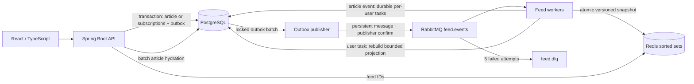

# Signal — materialized category feeds

A runnable full-stack example centered on fan-out-on-write: Java 25 / Spring Boot 4.1.1, React 19.3.0 / TypeScript / Vite 8.3.0, PostgreSQL 17, Redis 7.4 and RabbitMQ 4.1. No Kafka or Elasticsearch. Maven builds the backend; JDBC makes transaction boundaries and query costs explicit. API and worker use the same application with separate runtime roles.

## Start everything in Docker

Prerequisites: Docker Engine/Desktop with Compose v2, free ports 3000, 5432, 6379, 5672, 8080, 15672; allow roughly 4 GB RAM. First build needs internet access.

From this repository directory:

```bash
docker compose --profile app up -d --build
# Wait until status is UP (the first image build can take several minutes):
curl http://localhost:8080/actuator/health
# Once UP, seed via a one-shot container:
docker compose --profile seed run --build --rm seed
```

Open <http://localhost:3000>. Sign in with `user001@example.com` / `FeedDemo123!`. Users `user001` through `user100` use the same demo password. Registration is also available. RabbitMQ management: <http://localhost:15672>, `feed` / `feed-dev`.

If the seed reports an unmigrated schema, wait for API startup and rerun it. The seed requires a running worker and exits nonzero if materialization does not finish within 180 seconds.

```bash
docker compose --profile app logs -f api worker
docker compose --profile app ps
docker compose --profile app up -d --scale worker=3
# Stop containers, keeping data:
docker compose --profile app down
```

## Dependencies in Docker, applications locally

Prerequisites: JDK 25, Maven 3.9+, Node 22.12+ (22.19 tested), npm, Docker Compose. Python 3.11+ is needed only for running seed/integration scripts outside Docker.

```bash
docker compose up -d --wait
cd backend
mvn spring-boot:run
```

A local backend runs both API and worker by default. In another terminal:

```bash
cd frontend
npm ci
npm run dev
```

Open <http://localhost:5173>. Vite forwards `/api` to localhost:8080. Run the same Docker seed command above; it connects directly to the dependency containers. Alternatively:

```bash
python3 -m venv .venv
. .venv/bin/activate
pip install -r scripts/requirements.txt
python scripts/seed.py
```

Do not start both local and Docker APIs on port 8080. To split local roles, run one backend with `WORKER_ENABLED=false`, and another with `WORKER_ENABLED=true SERVER_PORT=8081`. Configuration variables: `DB_URL` (JDBC URL), `DB_USER`, `DB_PASSWORD`, `REDIS_HOST`, `RABBIT_HOST`, `RABBIT_USER`, `RABBIT_PASSWORD`, `WORKER_ENABLED`. Defaults match Compose. Python scripts use `DATABASE_URL` (PostgreSQL URL), `REDIS_URL`, `API_URL`, `RABBIT_MANAGEMENT_URL`.

## Architecture



**PostgreSQL** is the source of truth for users, BCrypt hashes, articles, many-to-many categories/subscriptions, durable feed projections, outbox and deduplication records. Foreign keys and transactions prevent partial publication. Indexes support recipient lookup and ordered per-user projections. **Redis** serves precomputed ordered IDs cheaply; article bodies are stored once and hydrated in one SQL query per page. **RabbitMQ** decouples publication from fan-out, supports competing workers, persistent messages, confirmations and dead-letter handling. A second authoritative NoSQL store is unnecessary for this example.

### Publication and fan-out

1. API transaction inserts article, category associations and an `ARTICLE` outbox row; commit returns HTTP 201 without needing RabbitMQ or Redis.
2. Relay selects 50 unpublished rows with `FOR UPDATE SKIP LOCKED`, sends persistent messages containing outbox IDs, waits for broker confirm and checks returned/unroutable messages. Only then does it mark rows published. Failure rolls back; next poll retries.
3. An article consumer atomically inserts its deduplication marker and a `USER` outbox task for every distinct matching subscriber. Existing feed members are included when an article's categories change, allowing removal from old audiences.
4. Each user task locks that user's row, rebuilds at most the newest 1,000 matching IDs in PostgreSQL, increments `feed_version`, and atomically writes `feed:{userId}:version` in Redis. Different users can be processed concurrently. This implementation rebuilds bounded snapshots for simplicity rather than incrementally applying deltas.
5. The transaction commits, then the listener acknowledges. Normal feed reads fetch the committed version, ordered IDs from Redis and article bodies in a batch. They never search categories.

Ordering uses monotonically allocated article IDs, descending. This gives a unique, precisely representable Redis score and stable exclusive `before` pagination, including equal timestamps. It is **allocation order**, not strict transaction-commit or timestamp order; concurrent transactions can commit out of order. Edits do not move articles to the top. IDs are constrained below 2^53. Pages are live, not an immutable pagination snapshot; subscription changes can alter subsequent pages.

### Subscription changes

`PUT /api/subscriptions` replaces the user's complete category set and writes a user outbox event in one transaction. Returns 202. Rebuilds read current subscriptions, so stale/reordered events cannot reintroduce an older subscription set. New categories backfill historical articles; removed categories disappear unless another subscribed category still matches. Empty subscriptions produce an empty feed. The UI tells the user to refresh after a short delay. Old results can remain visible while work is pending: eventual consistency is intentional.

### Failure and idempotency

- Article/subscription writes and outbox insertion are atomic. RabbitMQ downtime leaves committed outbox work pending.
- Delivery is at least once. A crash after confirm but before marking published can duplicate a message. `processed_event(event_id)` is inserted in the same transaction as the event's effects; duplicates do nothing. Transaction rollback also rolls back the marker.
- Each user is a separate durable task, so a crash midway through a large audience does not lose unfinished users. PostgreSQL row locks serialize rebuilds for the same user across workers.
- Redis snapshot replacement is one Lua operation. Snapshots have **versioned keys**: a Redis write followed by a PostgreSQL rollback leaves an unreachable key, not an incorrect current feed. Old/orphan snapshots expire after 24 hours. Member `0` is an empty-feed marker, excluded from responses and seed counts.
- Redis loss/expiry is recovered lazily from `feed_entry` under the user lock. Redis unavailability returns an error (connection failures map to 503); there is no silent category-query fallback. Failed workers retry five times with exponential delays, then reject to `feed.dlq` through `feed.dead`. Fix the dependency before replaying.
- To replay a failed **valid** event, republish its original numeric payload to exchange `feed.events`, routing key `work`, using RabbitMQ management. Remove the DLQ copy after successful processing. Do not replay malformed payloads. The integration test deliberately leaves one poison message for inspection.
- Inspect `SELECT count(*) FROM outbox WHERE published_at IS NULL;`, oldest pending `created_at`, worker logs, queue depth and DLQ depth. Outbox and processed-event retention are deliberately manual: retain outbox rows while messages might refer to them, and retain deduplication markers for the full replay window. No automated purge that could break replay is included.

### Scale boundaries

Worker replicas and relay instances can share PostgreSQL/RabbitMQ safely. Feed reads avoid per-read category searches; only a small user/version lookup and article hydration hit PostgreSQL. Each active snapshot and durable user projection is capped at 1,000 real entries. Historical Redis versions expire, so memory also depends on update rate over the last 24 hours.

This is a demonstrable architecture, **not a claim of million-user throughput**. Audience expansion currently uses a single SQL insert-select transaction; full 1,000-entry snapshots amplify writes. For very large audiences, introduce keyset-paginated fan-out tasks and incremental updates; for huge categories, consider hybrid category timelines. Partition feed tables/queues, add read replicas/article caching, use Redis Cluster and HA RabbitMQ/PostgreSQL after measurement. Compose uses single-node services, not HA. No performance SLO has been benchmarked.

## Deterministic seed and reset

`seed.py` reserves users 1–100 and articles 1–1000, inserts deterministic article timestamps, and makes every seeded user subscribe to all 10 categories. There are **1,000 distinct shared articles**, not 100,000 duplicated articles. Each user receives 1,000 unique IDs: **100,000 materialized feed entries**. The script emits user outbox events and waits for real workers to populate Redis; it does not bypass the worker with direct Redis writes.

Reruns upsert fixture rows, restore all category subscriptions and demo passwords, advance identity sequences, enqueue new rebuild tasks, and verify every user's count. Existing unrelated users/articles remain. Event IDs/feed versions advance on reruns; fixture data and memberships remain deterministic on an otherwise unchanged database. Collisions with nonfixture reserved IDs cause an explicit failure. Extra articles or edited fixture articles mean the dataset is no longer pristine. For exact fixture contents, reset the dedicated Compose project:

```bash
# DELETES this project's PostgreSQL, Redis and RabbitMQ volumes and all demo changes:
docker compose --profile app down -v
# For all-container mode:
docker compose --profile app up -d --build
# Wait for health UP, then:
docker compose --profile seed run --build --rm seed
```

For local-app mode, stop the local backend before resetting, restart dependencies with `docker compose up -d --wait`, then restart the backend before seeding. Verify counts:

```bash
docker compose exec postgres psql -U feed -d feed -c \
  'SELECT (SELECT count(*) FROM app_user) users, (SELECT count(*) FROM category) categories, (SELECT count(*) FROM article) articles, (SELECT count(*) FROM feed_entry) feed_entries;'
docker compose exec postgres psql -U feed -d feed -c \
  'SELECT user_id,count(*) FROM feed_entry GROUP BY user_id ORDER BY user_id;'
```

## API overview

All endpoints except registration and health require HTTP Basic authentication. JSON request/response bodies; `GET /api/me` acts as credential validation for the UI.

| Method | Path | Purpose |
|---|---|---|
| POST | `/api/register` | `{email,name,password,role}`; 201 (`READER` or `WRITER`; defaults to `READER`) |
| GET | `/api/me` | Current user and feed version |
| GET | `/api/categories` | Available categories |
| GET | `/api/subscriptions` | Current category IDs |
| PUT | `/api/subscriptions` | `{categoryIds:[1,2]}`; 202, asynchronous rebuild |
| POST | `/api/articles` | `{title,body,categoryIds:[1,2]}`; 201 |
| PUT | `/api/articles/{id}` | Same payload; author only |
| GET | `/api/articles/{id}` | Article detail |
| GET | `/api/articles?before=100&limit=20` | Global article listing |
| GET | `/api/feed?before=100&limit=20` | `{items:[...],nextCursor:number\|null}` |
| GET | `/actuator/health` | Dependency health |

`limit` is 1–100, default 20. Omit `before` on the first page; pass `nextCursor` for subsequent pages. Invalid input: 400; missing/incorrect authentication: 401; duplicate email: 409; unknown/not-owned article: 404. Articles must have 1–10 categories; subscriptions may be empty.

```bash
curl -u 'user001@example.com:FeedDemo123!' http://localhost:8080/api/me
curl -u 'user001@example.com:FeedDemo123!' 'http://localhost:8080/api/feed?limit=20'
curl -u 'user001@example.com:FeedDemo123!' -H 'Content-Type: application/json' \
  -d '{"title":"Java 25 in practice","body":"An example article.","categoryIds":[1,3]}' \
  http://localhost:8080/api/articles
curl -u 'user001@example.com:FeedDemo123!' -X PUT -H 'Content-Type: application/json' \
  -d '{"categoryIds":[1,2]}' http://localhost:8080/api/subscriptions
```

## Tests

```bash
cd backend
mvn test
mvn package
cd ../frontend
npm ci
npm test
npm run build
cd ..
docker compose config --quiet
```

Real-service integration suite (requires seeded dependencies, running API/worker and the Python environment above):

```bash
python scripts/integration_test.py
```

It tests the complete article → outbox → RabbitMQ → Redis → API path, duplicate delivery, cache recovery, category edits, subscription removal/backfill, disjoint cursor pages, validation rollback and poison-message DLQ behavior. It creates a uniquely named test user/article and leaves these for inspection. Reset/reseed afterward for exact initial counts. For an optional disruptive RabbitMQ outage/recovery test, run `python scripts/outage_test.py` from the repository root. It temporarily stops this project’s broker and restarts it in a `finally` block. Docker Compose is used for integration services rather than Testcontainers. CI performs the same tests on a fresh database. See `VERIFICATION.md` for checks actually run during packaging.

## Demo security and scope

BCrypt password hashes, authenticated endpoints and ownership checks are included. Basic credentials live only in frontend memory and are sent on each request; use HTTPS outside localhost. This example disables CSRF and uses same-origin proxies with no permissive CORS configuration; a production browser app should use an established OIDC/session design with appropriate CSRF protection, rate limits, secret management and TLS. Demo credentials are public and Compose ports bind only to loopback. Do not expose this setup directly to the internet. No deletion, ranking, email verification or full-text search is implemented.

## Repository

- `backend/`: API, security, feed projection/cache, RabbitMQ topology, relay/worker, Flyway, unit tests.
- `frontend/`: React UI, login/registration, subscription controls, article creation/editing, paginated feed and API-client tests.
- `scripts/`: deterministic seed container and real-service integration suite.
- `compose.yaml`: dependency-only default; `app` and `seed` profiles.
- `.github/workflows/ci.yml`: builds, tests and integration checks.

Version references checked at implementation: [React 19.3](https://react.dev/blog/2026/09/09/react-19-3), [Spring Boot requirements](https://docs.spring.io/spring-boot/system-requirements.html), [Vite releases](https://vite.dev/releases). Frontend dependency resolution is committed in `package-lock.json`.

## Reader and writer accounts

Registration offers `READER` (browse articles and manage subscriptions) or `WRITER` (the same, plus publish and edit their own articles). The API enforces writer permissions; hiding the editor is not the access-control boundary. Both feed and article-list responses include `author`, `author_id`, `categories: [{id,name}]`, and `categoryIds`. Cards display the author and category badges.

Flyway V2 adds roles without resetting data. Existing article authors become writers; other existing accounts become readers. Fresh seed accounts are writers because all 100 author fixture articles. Create a reader from registration to test read-only access. Existing display names are preserved during migration. Restart/rebuild the backend to apply V2, then rebuild the frontend (`docker compose --profile app up -d --build` for Docker). No database reset is required.

Role/metadata regression test (running API/worker required): `python scripts/roles_test.py`. It registers temporary reader/writer accounts, checks HTTP 403 for reader writes, and verifies author/category metadata in article and feed responses. Applied Flyway migrations must retain their original content, including formatting; add new migration files for schema changes.
